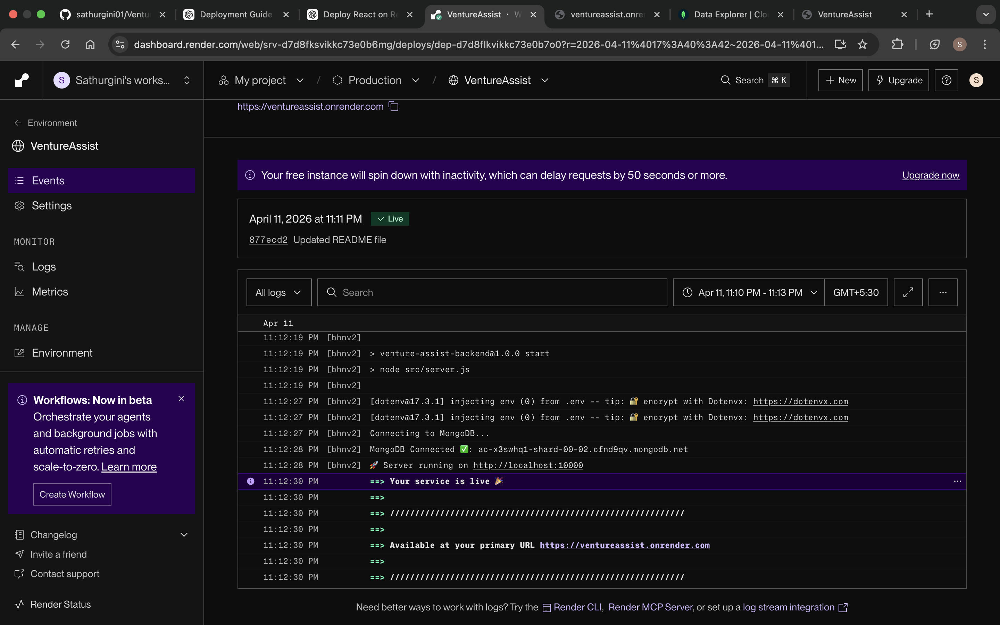
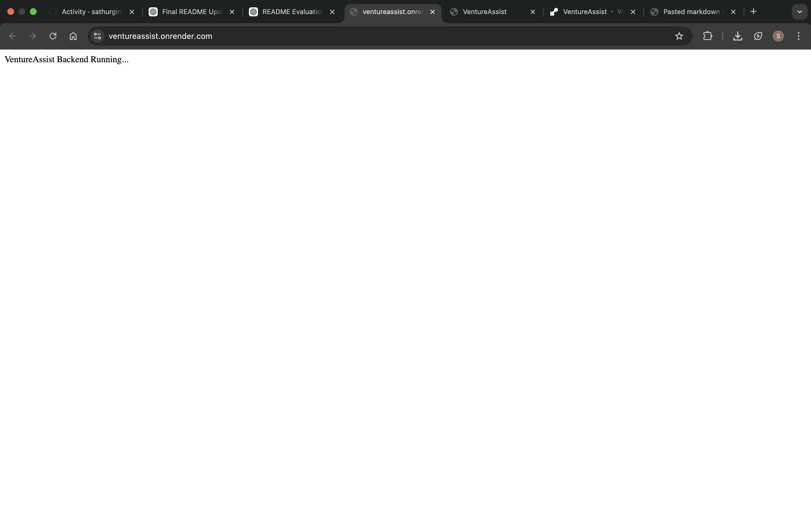
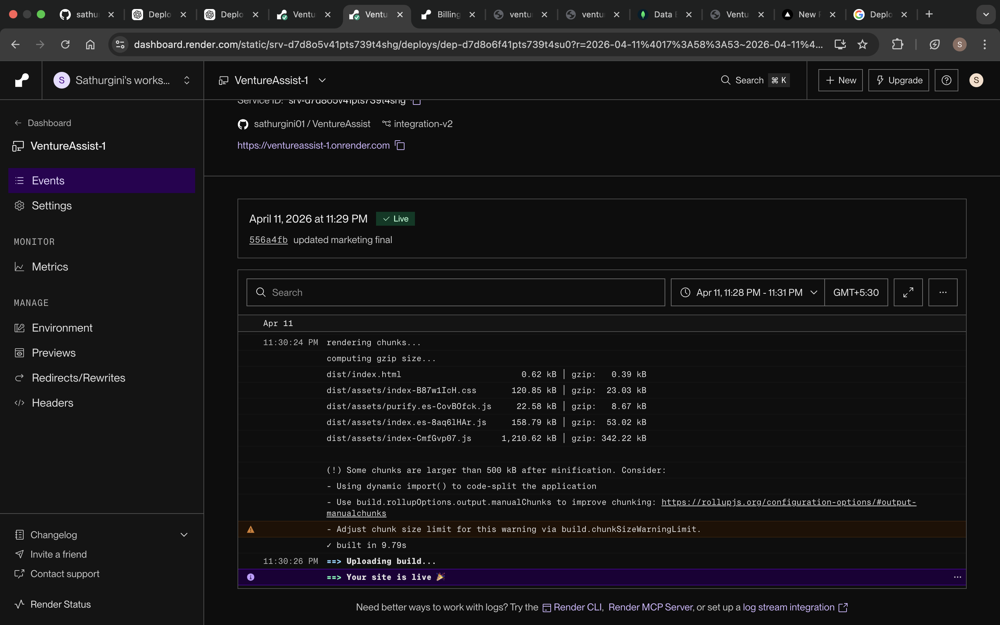
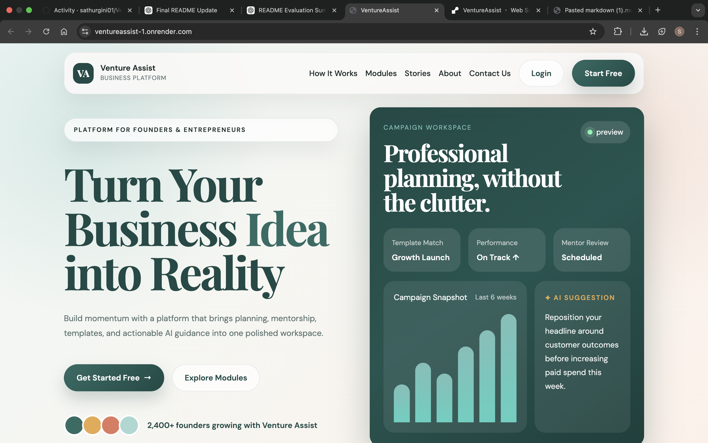

# Deployment Report – VentureAssist

**SE3040 – Application Frameworks**
**BSc (Hons) in Information Technology Specialized in Software Engineering – Year 03**

---

## 1. Project Overview

VentureAssist is a full-stack startup support platform built with **Node.js / Express** on the backend and **React ** on the frontend, backed by **MongoDB Atlas**. Both services are deployed and publicly accessible on **Render**.

---

## 2. Live Deployment URLs

| Service | Platform | Live URL |
|---|---|---|
| Frontend Application | Render (Static Site) | https://ventureassist-1.onrender.com |
| Backend REST API | Render (Web Service) | https://ventureassist.onrender.com |
| Database | MongoDB Atlas (Cloud) | Connected via `MONGO_URI` environment variable |

---

## 3. Backend Deployment – Render Web Service

### 3.1 Platform Details

| Property | Value |
|---|---|
| Platform | Render |
| Service Type | Web Service |
| Runtime | Node.js 18 |
| Root Directory | `server/` |
| Build Command | `npm install` |
| Start Command | `node src/server.js` |
| Region | Oregon, USA |

### 3.2 Step-by-Step Setup

1. **Push source code to GitHub**
   ```bash
   git add .
   git commit -m "Deploy: backend ready"
   git push origin main
   ```

2. **Create a new Web Service on Render**
   - Go to [dashboard.render.com](https://dashboard.render.com)
   - Click **New → Web Service**
   - Connect your GitHub repository (`sathurgini01/VentureAssist`)

3. **Configure the service**
   - Name: `VentureAssist`
   - Root Directory: `server`
   - Build Command: `npm install`
   - Start Command: `node src/server.js`

4. **Add Environment Variables** (under *Environment* tab — never commit these to git)

   | Variable | Purpose |
   |---|---|
   | `PORT` | Server port (Render sets automatically) |
   | `MONGO_URI` | MongoDB Atlas connection string |
   | `JWT_SECRET` | Secret key for JWT token signing |
   | `GEMINI_API_KEY` | Google Gemini AI API key |
   | `GEMINI_MODEL` | Gemini model identifier |
   | `NODE_ENV` | Set to `production` |

5. **Deploy** – Click **Create Web Service**. Render pulls the code, runs `npm install`, and starts the server.

6. **Verify** – Visit `https://ventureassist.onrender.com` → should display:
   ```
   VentureAssist Backend Running...
   ```

### 3.3 Backend Deployment Evidence

The screenshot below shows the Render dashboard with the backend **Live** status and successful startup logs including MongoDB connection confirmation:





---

## 4. Frontend Deployment – Render Static Site

### 4.1 Platform Details

| Property | Value |
|---|---|
| Platform | Render |
| Service Type | Static Site |
| Framework | React + Vite |
| Root Directory | `client/` |
| Build Command | `npm install && npm run build` |
| Publish Directory | `dist` |

### 4.2 Step-by-Step Setup

1. **Ensure the production API URL is configured**

   In `client/.env` (local) and as a Render environment variable:
   ```env
   VITE_API_BASE_URL=https://ventureassist.onrender.com
   ```

2. **Create a new Static Site on Render**
   - Go to [dashboard.render.com](https://dashboard.render.com)
   - Click **New → Static Site**
   - Connect the same GitHub repository

3. **Configure the static site**
   - Name: `VentureAssist-1`
   - Root Directory: `client`
   - Build Command: `npm install && npm run build`
   - Publish Directory: `dist`

4. **Add Environment Variable**

   | Variable | Value |
   |---|---|
   | `VITE_API_BASE_URL` | `https://ventureassist.onrender.com` |

5. **Configure SPA routing** – A `_redirects` file in `client/public/` ensures React Router works:
   ```
   /*  /index.html  200
   ```

6. **Deploy** – Click **Create Static Site**. Render runs the Vite build and serves the `dist` folder as a CDN-backed static site.

7. **Verify** – Visit `https://ventureassist-1.onrender.com` → the landing page should load.

### 4.3 Frontend Deployment Evidence

The screenshot below shows the Render dashboard with the frontend **Live** status and the successful Vite build output (`dist/index.html` generated, `Your site is live`):





---

## 5. Database Deployment – MongoDB Atlas

### 5.1 Setup Steps

1. Create a free cluster at [cloud.mongodb.com](https://cloud.mongodb.com)
2. Under **Database Access**, create a user with read/write permissions
3. Under **Network Access**, add `0.0.0.0/0` to allow connections from Render
4. Copy the connection string and set it as `MONGO_URI` in Render's environment variables:
   ```
   mongodb+srv://<user>:<password>@cluster0.xxxxx.mongodb.net/ventureassist?retryWrites=true&w=majority
   ```

### 5.2 Collections Used

| Collection | Purpose |
|---|---|
| `users` | Authentication and role management |
| `businesses` | Business ideas and SWOT data |
| `trackers` | Business idea progress trackers |
| `finances` | Finance profiles, expenses, revenue |
| `campaigns` | Marketing campaigns |
| `legaltasks` | Legal compliance tasks |
| `submissions` | Legal evidence submissions |
| `helprequests` | Mentor help requests |
| `toolkits` | Legal toolkits |
| `mentorapplications` | Mentor application records |

---

## 6. Environment Variables Reference

> **Security Note:** Never commit `.env` files to version control. All secrets are managed through Render's *Environment* dashboard.

### Backend (`server/.env`)

```env
# Server
PORT=5000
NODE_ENV=production

# Database
MONGO_URI=<your_mongodb_atlas_uri>

# Authentication
JWT_SECRET=<strong_random_secret>

# AI Integration
GEMINI_API_KEY=<your_gemini_api_key>
GEMINI_MODEL=gemini-1.5-flash
```

### Frontend (`client/.env`)

```env
VITE_API_BASE_URL=https://ventureassist.onrender.com
```

---

## 7. CI/CD Workflow

Render provides automatic continuous deployment:

1. Developer pushes code to the `main` branch on GitHub
2. Render detects the push via webhook
3. Render automatically runs the build command
4. If the build succeeds, the new version goes live
5. If the build fails, the previous version remains live (zero-downtime rollback)

---

## 8. Deployment Architecture Diagram

```
┌─────────────────────────────────────────────────────────┐
│                     GitHub Repository                    │
│              sathurgini01/VentureAssist                  │
└───────────────────────┬──────────────────────────────────┘
                        │  git push (webhook)
           ┌────────────▼────────────┐
           │                         │
    ┌──────▼──────┐          ┌───────▼──────┐
    │   Render     │          │    Render    │
    │  Web Service │          │ Static Site  │
    │  (Backend)   │          │  (Frontend)  │
    │  Node.js 18  │          │ React + Vite │
    └──────┬──────┘          └──────────────┘
           │  MONGO_URI              ▲
           ▼                         │ VITE_API_BASE_URL
    ┌──────────────┐                 │
    │ MongoDB Atlas │                │
    │  (Cloud DB)   │◄───────────────┘
    └──────────────┘        REST API calls
```

---

## 9. Troubleshooting

| Issue | Cause | Solution |
|---|---|---|
| Backend returns 502/503 | Free tier spin-down (cold start ~30s) | Wait 30 seconds and retry |
| `MongoServerError` | Wrong `MONGO_URI` or Atlas IP whitelist | Verify Atlas Network Access: `0.0.0.0/0` |
| `401 Unauthorized` | JWT_SECRET mismatch between local and Render | Ensure identical `JWT_SECRET` in Render env |
| Frontend shows blank page | SPA routing issue | Confirm `_redirects` file exists in `client/public/` |
| `CORS error` | Backend CORS not allowing frontend origin | Add frontend URL to CORS config in `app.js` |

---

*Deployment confirmed live on: 11 April 2026*
*Platform: Render (frontend + backend), MongoDB Atlas (database)*
